# 📸 Capturas de Pantalla - To-Do List

## Vista Principal

### Interfaz Completa
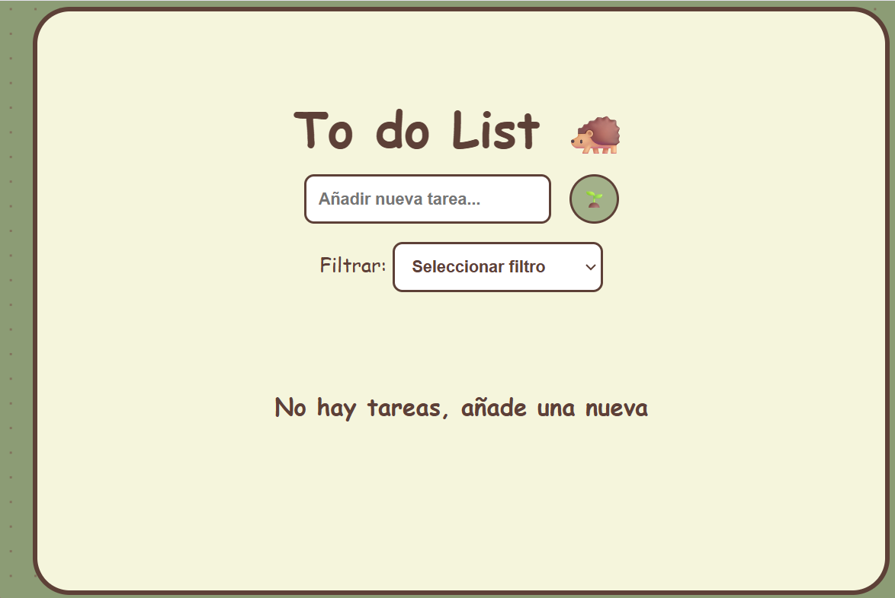
*Vista principal de la aplicación mostrando el título, formulario de entrada y lista de tareas*

---

## Funcionalidades

### 1. Agregar Nueva Tarea
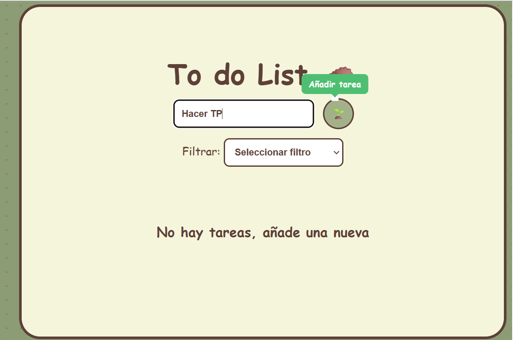
*Formulario para añadir una nueva tarea con tooltip visible*

### 2. Lista de Tareas
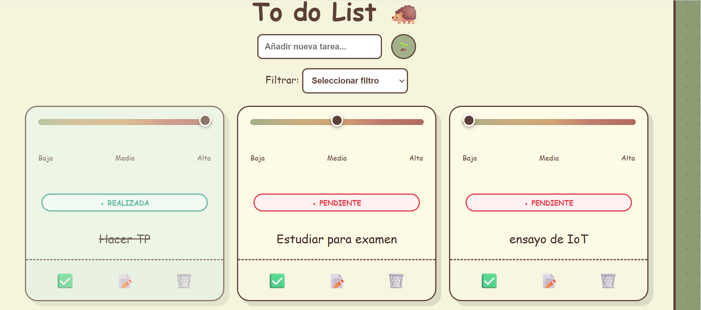
*Vista de múltiples tareas con diferentes prioridades y estados*

### 3. Slider de Prioridades
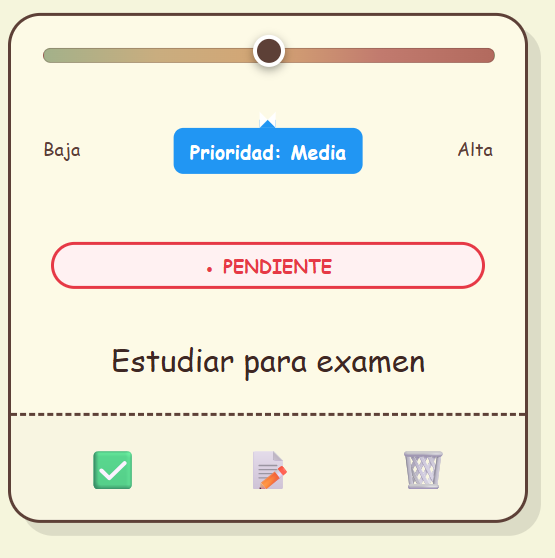
*Slider degradado mostrando los niveles de prioridad (Baja, Media, Alta)*

### 4. Editar Tarea
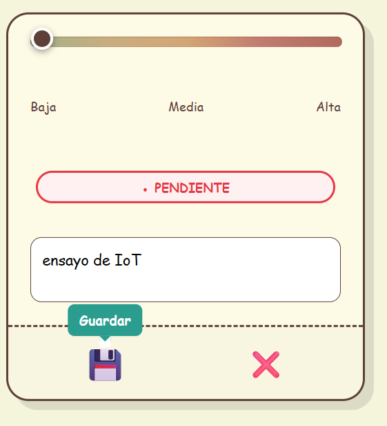
*Tarjeta en modo edición con textarea y botones de guardar/cancelar*

### 5. Tarea Completada
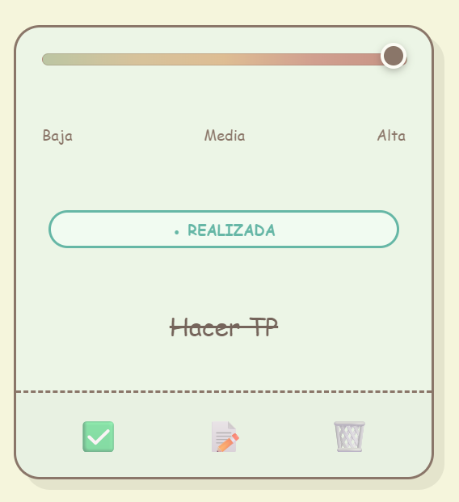
*Tarea marcada como realizada con texto tachado y badge verde*

### 6. Diálogo de Confirmación
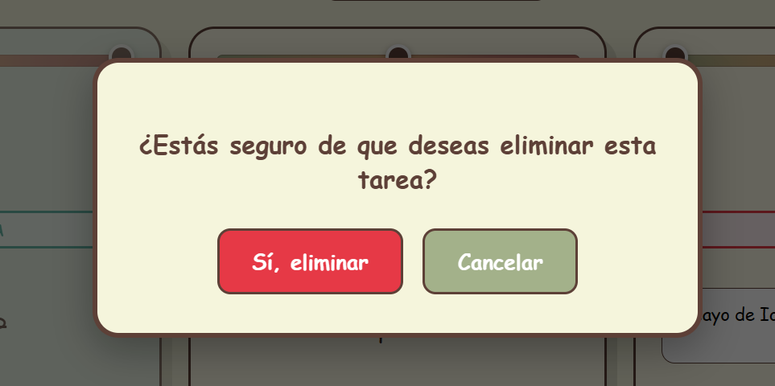
*Pop up para confirmar eliminación de tarea*

---

## Sistema de Filtros

### Filtro: Todas las Tareas
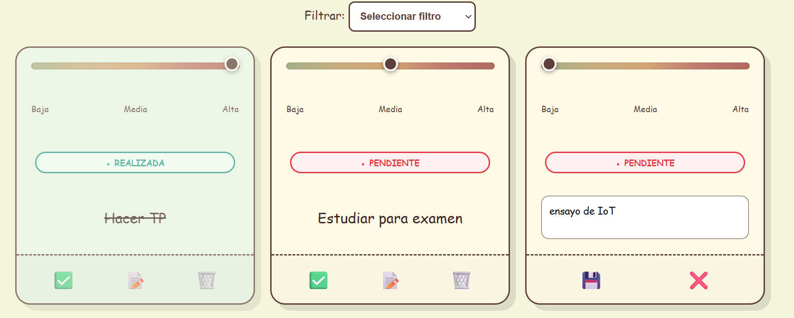
*Vista mostrando todas las tareas sin filtro*

### Filtro: Tareas Completadas
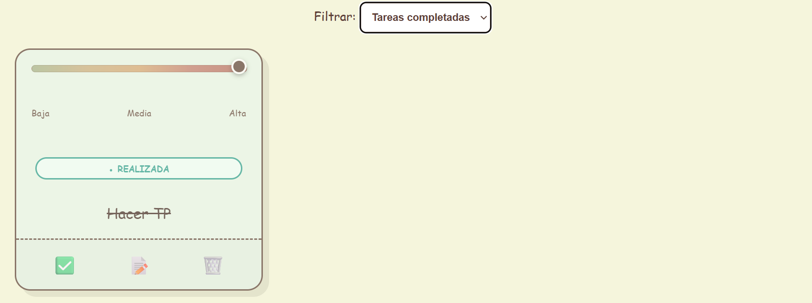
*Vista mostrando solo las tareas completadas*

### Filtro: Tareas Pendientes
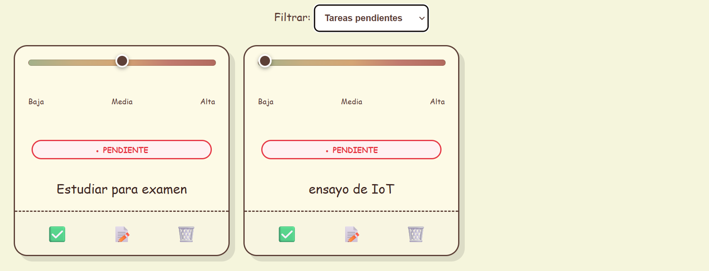
*Vista mostrando solo las tareas pendientes*

---

## Estados Vacíos

### Sin Tareas
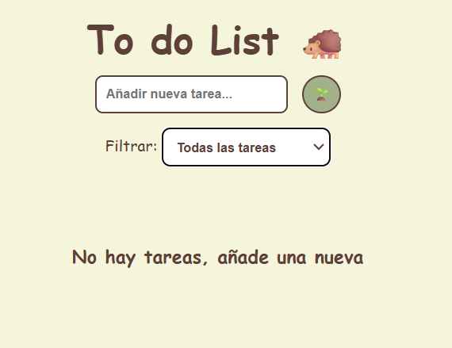
*Mensaje cuando no hay ninguna tarea creada*

### Sin Tareas Completadas
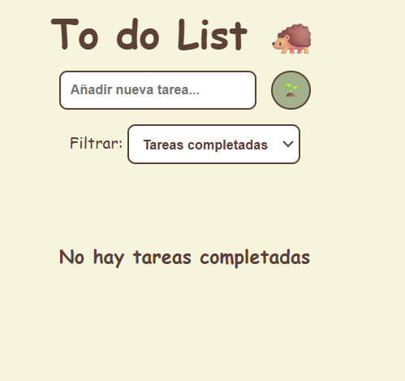
*Mensaje cuando no hay tareas completadas*

### Sin Tareas Pendientes
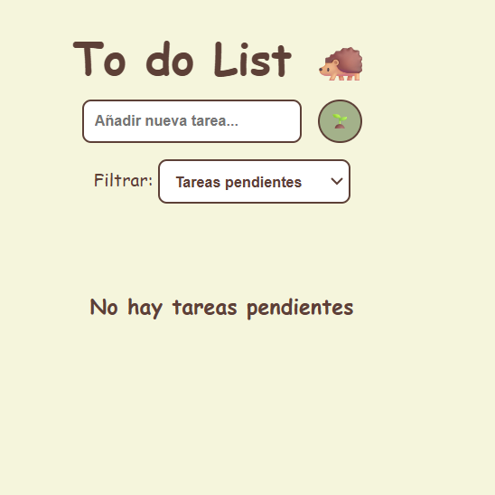
*Mensaje cuando no hay tareas pendientes*

---

## Responsive Design

### Vista en PC
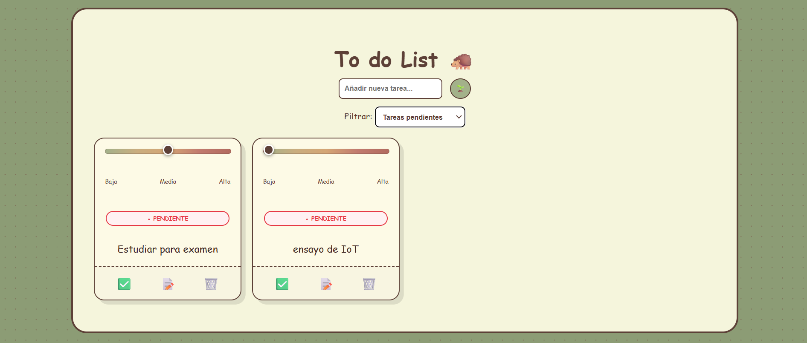
*Diseño adaptado para pantallas medianas*

### Vista en Tablet
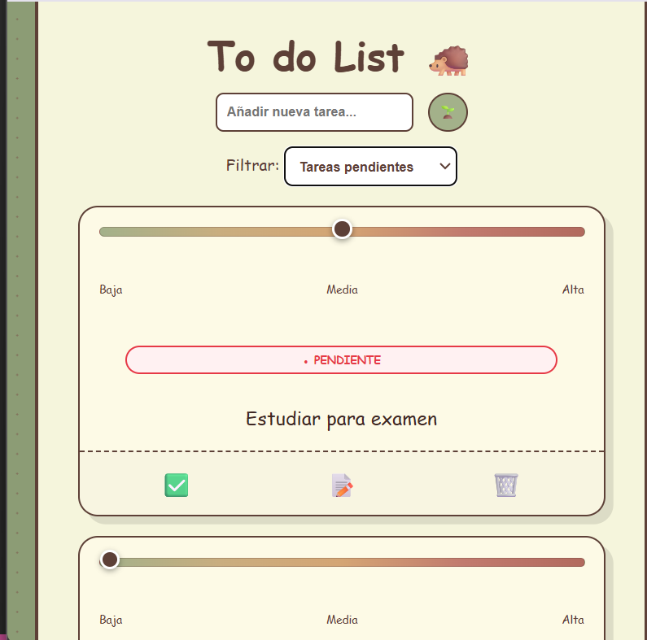
*Diseño adaptado para pantallas pequeñas*

---

## Validaciones

### Error: Campo Vacío
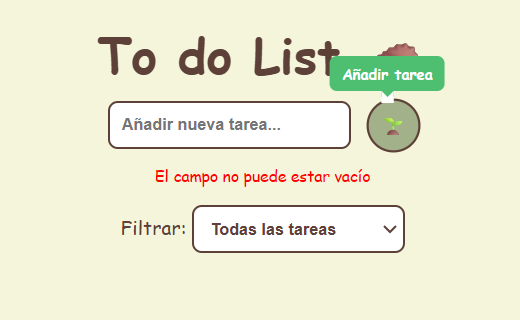
*Mensaje de error al intentar crear una tarea vacía*

### Error: Texto Muy Corto
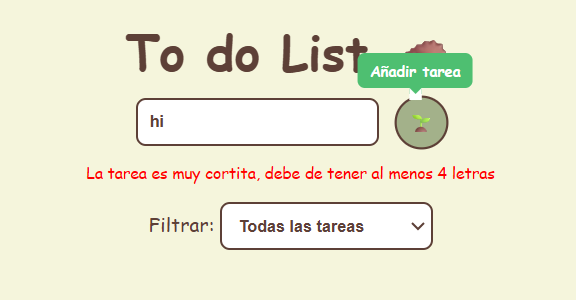
*Mensaje de error cuando el texto tiene menos de 4 caracteres*
